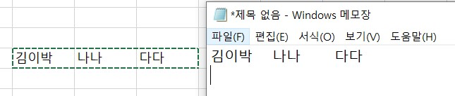

# Attendance-Check
google classroom 댓글 출석확인을 빠르게 할 수 있는 App 입니다.

학년 반 또는 학 학년 전체를 대상으로 출석 확인을 할 수 있으며  
출석 댓글을 남기지 않은 사람을 찾아냅니다.  


## How to use
[code](/client/WindowsFormsApp1/SchoolService.cs)  

Excel을 이용해 학생 이름을 한 행에 넣고 복사해서 변수에 맞게 집어 넣습니다. class00str 은 1학년 1반 입니다.  

이때 이름들은 tab으로 구분됩니다.  
  
```
//example
var class00Str = "김김김    가가가  나나나";
var class01Str = "박박박    수수수  냠냠냠";
var class02Str = "김김김    가가가  나나나";
var class03Str = "박박박    수수수  냠냠냠";

var class10Str = "박박박    수수수  냠냠냠";
var class11Str = "김김김    가가가  나나나";
var class12Str = "김김김    가가가  나나나";
var class13Str = "김김김    가가가  나나나";
```
---
구글 클래스룸 댓글을 복사 하세요('수업 댓글 **개'는 같이 복사되어도 상관 없습니다)  
  

  
App을 실행한 후 왼쪽 상자에 붙여넣기 후 버튼 클릭! 
